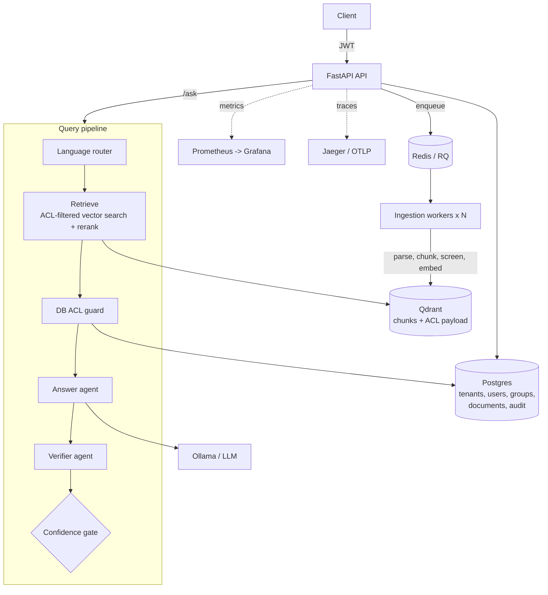

# Darija RAG Platform

A **multi-tenant knowledge platform** that lets organizations (faculties, companies) query their private documents in
**Modern Standard Arabic, Algerian Darija (Arabic script and Arabizi), French and English**, with citations, a
**verifier agent** that blocks ungrounded answers, and **document-level access control enforced inside the vector query**.

v2 of [darija-rag](#): the v1 single-user RAG core, rebuilt around the things enterprises actually ask about:
isolation, permissions, auditability, observability and measurable quality.

## Status (what is and isn't verified)

| Area | State |
|---|---|
| Auth (JWT), roles, tenant isolation, group ACLs, audit log, rate limits, quotas | Implemented, **covered by 42 automated tests (90% coverage)** |
| ACL equivalence (SQL rule = Qdrant filter = Python rule) | Exhaustively tested over all tenant/visibility/owner/group combinations |
| Alembic migrations | Applied, downgraded and drift-checked in CI |
| OpenTelemetry spans (`agent.retrieve/answer/verify`, `ingest.document`) | Verified against an in-memory exporter |
| Evaluation gate in CI | Works, but with a **lexical stand-in embedder** (plumbing smoke test, not a quality claim) |
| Docker Compose stack (Postgres, Redis, Qdrant, Ollama, workers, Prometheus, Grafana, Jaeger) | Written, **not yet run end-to-end** |
| Real-model quality (bge-m3 + reranker + Qwen) on a real corpus | **Not measured yet**: see [Roadmap](#roadmap) |

## Architecture



## Security model

| Threat | Mitigation |
|---|---|
| Tenant A reads tenant B's data | `tenant_id` is a mandatory filter in every vector query and every SQL query; foreign ids return **404** (existence is not leaked). Tested at API and retrieval level. |
| User reads a document they lack permission for | Document visibility (`tenant` / `restricted` + groups) is stored as vector payload and **filtered inside the Qdrant query**, so forbidden chunks are never retrieved. |
| Vector payload drifts from the DB (bug, partial failure) | Post-retrieval **DB re-authorization guard** drops unauthorized chunks *before the LLM sees them*; increments `kb_acl_guard_blocked_total` (alert if > 0). Tested with a simulated leak. |
| Prompt injection via uploaded documents | Per-sentence screening at ingestion (EN/FR/AR patterns), `<source>` tagging, and a system prompt that marks sources as untrusted data. Pattern screening is a mitigation, not a guarantee. |
| Hallucinated answers | Verifier agent + hard gate (`min_verifier_score`) + blended confidence threshold; the assistant abstains in the user's language. |
| Credential attacks | scrypt password hashing, constant-ish-time login for unknown users, per-email login rate limit, uniform error messages. |
| Stale access after offboarding | Users are re-loaded on every request: deactivation, role and group changes apply immediately (no long-lived claims trusted). |
| PII in logs | Audit log stores a hash of each question, never the text; all audit details pass through a PII redactor (emails, phones, long IDs). |
| Malicious uploads | Extension allowlist, size cap, PDF magic-byte check, path traversal neutralized (files stored under server-generated ids), SHA-256 dedupe, per-tenant quota. |
| Insecure deploys | `prod` mode refuses to start with the default JWT secret; compose refuses to start without secrets. |

Known limits are listed in [docs/security.md](docs/security.md).

## Quickstart

### Full stack (Docker)

```bash
cp .env.example .env            # fill POSTGRES_PASSWORD and RAG_JWT_SECRET (openssl rand -hex 32)
docker compose up -d --build
docker compose exec ollama ollama pull qwen2.5:7b-instruct
```
API docs: http://localhost:8000/docs · Grafana: :3000 · Prometheus: :9090 · Jaeger: :16686

### Local (no Docker)

```bash
python -m venv .venv && source .venv/bin/activate
pip install -e ".[dev]"
export RAG_DATABASE_URL=sqlite:///./dev.db
alembic upgrade head
ollama pull qwen2.5:7b-instruct
uvicorn ragplatform.api.app:app_factory --factory --reload
```
(First request downloads the embedding model, ~2 GB. For a download-free smoke run:
`RAG_EMBEDDER=hash RAG_RERANKER=none`. It is lexical only, not for real use.)

### Web UI

The production frontend is served by the API at http://localhost:8000/ after the Tailwind assets are built:

```bash
cd web
npm install
npm run build
```

The UI supports sign-in, multilingual questions with citations, document status, and uploads for admins/editors.

### Try it

```bash
# 1. create an organization + its admin
curl -s localhost:8000/tenants -H 'Content-Type: application/json' \
  -d '{"tenant_name":"Univ Alger","admin_email":"admin@univ.dz","admin_password":"correct-horse-battery"}'

# 2. log in
TOKEN=$(curl -s localhost:8000/auth/login -d 'username=admin@univ.dz&password=correct-horse-battery' | jq -r .access_token)
AUTH="Authorization: Bearer $TOKEN"

# 3. create a group and a viewer who belongs to it
GID=$(curl -s localhost:8000/groups -H "$AUTH" -H 'Content-Type: application/json' -d '{"name":"Scolarité"}' | jq -r .id)
curl -s localhost:8000/users -H "$AUTH" -H 'Content-Type: application/json' \
  -d "{\"email\":\"etudiant@univ.dz\",\"password\":\"another-long-password\",\"role\":\"viewer\",\"group_ids\":[\"$GID\"]}"

# 4. upload a document visible only to that group
curl -s localhost:8000/documents -H "$AUTH" -F file=@reglement.pdf -F visibility=restricted -F group_ids=$GID

# 5. ask (as the admin, or log in as the viewer)
curl -s localhost:8000/ask -H "$AUTH" -H 'Content-Type: application/json' \
  -d '{"question":"وين نقدر نودع ملف التسجيل ؟"}'
```

Ingestion is asynchronous in `rq` mode: poll `GET /documents/{id}` until `status` is `ready`.

## Roles

| Role | Can do |
|---|---|
| `viewer` | Ask questions over documents they can see |
| `editor` | + upload documents, manage/delete their own |
| `admin` | + manage users, groups, any document, read the audit log |

## Observability

- **Metrics** (`/metrics`): HTTP rate/latency by route, per-agent latency (`kb_agent_seconds{agent=retrieve|answer|verify}`),
  abstention rate, ingestion outcomes, injection chunks flagged, ACL-guard blocks.
- **Traces**: set `RAG_OTLP_ENDPOINT` (compose does this). One trace per request with a span per agent.
- **Probes**: `/health` (liveness), `/ready` (Postgres + Qdrant).

## Quality gates

```bash
ruff check . && pytest -q --cov=ragplatform     # 42 tests
RAG_EMBEDDER=hash RAG_RERANKER=none python eval/run_eval.py --min-recall 0.8
```

CI fails on lint errors, coverage < 85%, model/migration drift, or retrieval recall below the gate.
To measure **real** quality, run `python eval/run_eval.py` with `RAG_EMBEDDER=bge` against a benchmark built from your own documents
(`eval/benchmark.jsonl` format: question, expected source, expected keywords).

## Configuration

Env vars prefixed `RAG_` (see `src/ragplatform/config.py`): `DATABASE_URL`, `QUEUE_MODE` (`inline`|`rq`), `QDRANT_URL`,
`JWT_SECRET`, `LLM_MODEL`, `ABSTAIN_THRESHOLD`, `MIN_VERIFIER_SCORE`, `MAX_DOCS_PER_TENANT`, `ASK_RATE_LIMIT_PER_MIN`, ...

## Design decisions

See [docs/adr](docs/adr): ACL enforced in the vector query (ADR-001), Qdrant + Postgres split (ADR-002),
RQ over Celery (ADR-003), dependency-light auth (ADR-004).

## Roadmap

- [ ] Run and document the full compose stack end-to-end; publish real benchmark numbers (bge-m3 + reranker) on a real corpus
- [ ] Load test (k6/Locust) with published p95 latency and throughput
- [ ] Helm chart + Kubernetes deployment guide
- [ ] Hybrid retrieval (Qdrant sparse vectors / BM25): v1 had it, v2 currently uses dense + reranker only
- [ ] Redis-backed rate limiter for multi-replica API
- [ ] OIDC/SSO login, refresh tokens, token revocation list
- [ ] Object storage (MinIO/S3) instead of a shared volume
- [ ] OCR for scanned PDFs; web UI
- [ ] Automatic Algerian-Darija consistency check (flag Moroccan markers) in the eval suite

## License

MIT
